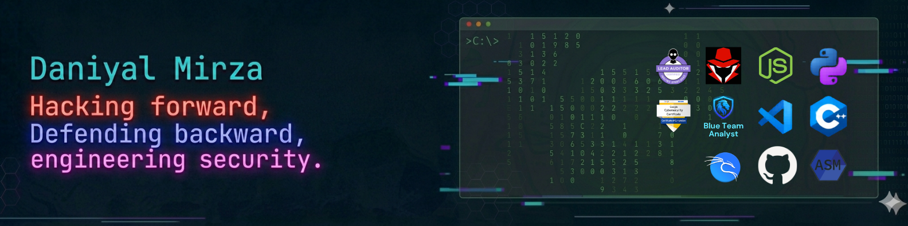

<!-- Banner -->

  

<!-- Title -->
<h1 align="center">Hi 👋, I'm Daniyal</h1>
<h3 align="center">aka <b>MDK-4203</b></h3>

<!-- Animated Typing Effect -->

  

## 📝 About Me

I don't just secure systems — **I break them first.** I blend offensive tradecraft like malware research and exploit development with defensive insights like SIEM detection engineering and AI-driven security automation. I learn by **building**: shipping secure full-stack portals with OWASP Top 10 controls baked in, architecting CTF competition platforms from scratch, developing dual-purpose network toolkits, and deploying open-source SOC stacks for real startups.

- 🔭 **Currently building:** Proprietary CTF infrastructure, Academic Portals, Pentesting Toolkit
- 🌱 **Currently learning:** Advanced exploit development, AI-driven security automation, and threat hunting methodologies
- 💼 **Open to:** Offensive, defensive, or purple team roles that reward technical depth and a builder mentality
- 💡 **Philosophy:** *I learn by building. I secure by breaking. I defend by understanding the attack.*
- 🎯 **Focus:** Vulnerability Assessment, Web Application Security, SIEM Detection Engineering, and Secure Coding Practices
- 🤝 **Collab:** Joint offensive/defensive work via [@Pause-n-Clause](https://github.com/Pause-n-Clause)
- 🌍 **Community:** Active Open Source Contributor

## 🚀 Languages and Tools I Use

### 🛡️ Offensive Security

  
  
  
  
  
  
  
  

### 🔒 Defensive Security

  
  
  
  
  
  
  

### 💻 Programming Languages

  
  
  
  
  
  
  
  

### 🎨 Frontend Development

  
  
  
  
  
  

### ⚙️ Backend Development

  
  
  
  
  

### 🗄️ Databases

  
  
  
  

### 🐳 DevOps & Infrastructure

  
  
  
  

## 🏗️ Notable Projects

<table>
  <tr>
    <td width="50%" valign="top">
      <h3>🛠️ V.A.M.P.I.R.E</h3>
      
<b>Dual-purpose network toolkit</b> — enterprise latency stabilization + offensive pentesting &amp; DDoS simulation

      

        
        
        
        
      

      
<a href="https://github.com/MDK-4203">View Repo →</a>

    </td>
    <td width="50%" valign="top">
      <h3>🏴 CTFd-less CTF Platform</h3>
      
<b>Full-stack CTF platform</b> from scratch — dynamic scoring, team management, live leaderboard

      

        
        
        
      

      
<a href="https://github.com/Pause-n-Clause">View Org →</a>

    </td>
  </tr>
  <tr>
    <td valign="top">
      <h3>🧪 Info-Stealer (Research)</h3>
      
<b>Lab-use malware research</b> — browser data extraction via encrypted/obfuscated channels to build detection techniques

      

        
        
      

    </td>
    <td valign="top">
      <h3>🔒 SOC Home Lab</h3>
      
<b>Full mini-SOC</b> — Wazuh, pfSense, Suricata, ClamAV, MISP, OpenCTI, ELK Stack, Sysmon

      

        
        
        
      

    </td>
  </tr>
  <tr>
    <td valign="top">
      <h3>🎓 Academic Portals (NCSA)</h3>
      
<b>31+ secure academic portals</b> with OWASP Top 10 controls and centralized CMS for Air University

      

        
        
        
      

    </td>
    <td valign="top">
      <h3>💬 LAN-Chat</h3>
      
<b>Cross-device LAN communication</b> — C++ backend with OpenMP and lightweight web frontend

      

        
        
        
      

    </td>
  </tr>
</table>

## 📊 GitHub Stats & Activity

<table align="center" width="100%" style="margin-top:4px;margin-bottom:2px">
  <tr>
    <td align="center" width="50%">
      
    </td>
    <td align="center" width="50%">
      
    </td>
  </tr>
</table>

<tr>
    <td align="center" colspan="2">
      
    </td>
  </tr>
</table>

 

<picture>
  <source media="(prefers-color-scheme: dark)" srcset="https://github.com/MDK-4203/MDK-4203/blob/output/github-snake-dark.svg"/>
  <source media="(prefers-color-scheme: light)" srcset="https://github.com/MDK-4203/MDK-4203/blob/output/github-snake.svg"/>
  
</picture>

## 🌏 Where to Find Me

  
  
  

 

  

